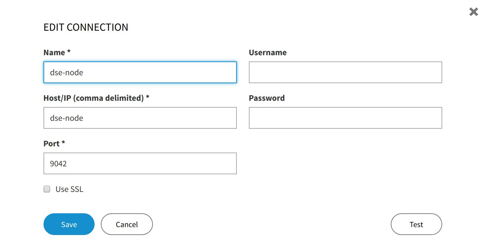

# Use Apache Cassandra as sink using DataStax Kafka Connector

## Building blocks

* Apache Cassandra as sink
* DataStax Kafka Connector
* Apache Kafka as messaging/streaming system
* Kafka Producers in batch and/or stream

## ToDo
* Create data producer
    * Batch
    * Stream (Twitter ?)
* Integrate DataStax Connector into Docker-Environment (Generic approach if possible)

## Development notes
* We use Docker to provide environment
* DataStax Kafka Connector works by configuration
* To use Webinterface for Cassandra use http://localhost:9091 and edit the connection
