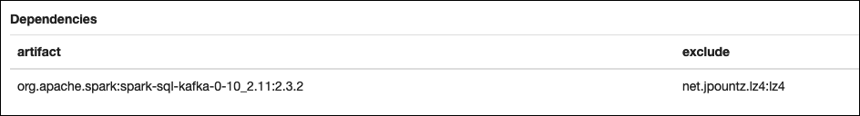

# Consuming Kafka Avro Messages from Spark

This project demonstrates how to read Avro-formatted messages from a Kafka topic using Spark 2.3.x.

It uses the following [Spark UDF](https://github.com/tubular/confluent-spark-avro) to get the Avro schema from the Confluent schema registry and deserializes the Avro using the Confluent Avro deserializer:

## Setting up the environment

In this description we assume that a Kafka / Spark environment is available similar to the one we support with the [Trivadis Modern Analytics Stack](https://github.com/TrivadisBDS/modern-data-analytics-stack). Therefore all external links are using the `analyticsplatform` alias.

You need to create a topic `person-v1` to be used in the test:

```
docker exec -ti broker-1 kafka-topics --create --zookeeper zookeeper-1:2181 --topic person-v1 --replication-factor 3 --partitions 8
```

## Make Spark UDF available

The Spark UDF for working with Avro and the Schema Registry is not available in a public maven repository. Therefore you either have to build it using `sbt` or you can download the pre-built version from the release page:

```
wget https://github.com/TrivadisBDS/various-bigdata-prototypes/releases/download/v1.0/confluent-spark-avro-assembly-1.2.jar
``` 

## Producing Kafka Avro Messages using Python
A client for testing as been implmented in Python. It can be used for testing the behaviour based on the environment created above. It produces messages into the `person-before` topic, which should then be processed by the stream processor. 

The python program can be found here: [`./scripts/producer.py`](./scripts/producer.py)

### Prepare Python environment
Before you can use the test client, you have to install the confluent python client. In order to do that, you first have to intall pip (if not yet done): 

```
sudo apt install python-pip
```

Now you can install the self-contained binaries of the Confluent Python client with avro support using:

```
pip install confluent-kafka
pip install confluent-kafka[avro]
```

### Producing Messages

The test procuder sends `Person` messages to a topic called `person-v1`, one at a time, using the following schema for the key

```
{
	"namespace": "my.test",
	"name": "PersonKey",
	"type": "record",
	"fields" : [
		 {
		   "name" : "id",
		   "type" : "string"
		 }
	]
}
```

and the following schema for the value portion of the message

```
{
	"namespace": "my.test",
	"name": "Person",
	"type": "record",
	   "fields" : [
		  {
		   "name" : "id",
		   "type" : "string"
		  },
		  {
		   "name" : "firstName",
		   "type" : "string"
		  },
		  {
		   "name" : "lastName",
		   "type" : "string"
		  }
	   ]
}
```

The test producer has to be called with the following five parameters, which define the value of the message:

* `brokers` - the list of broker(s) in the format `broker-1:9092,broker-2:9092`
* `schemaRegistryUrl` - the URL of the schema registry, in the format `http://localhost:8081`
* `timestamp` - the timestamp (in milli-sconds), use the following [link](https://currentmillis.com) to generate actual timestamps
* `id` - the ID of the person, will be used as the key
* `firstName` - the first name of the person
* `lastName` - the last name of the person

Here a sample call with all the necessary parameters

```
python producer.py analyticsplatform:9092 http://analyticsplatform:8089 1547628077671 10 Peter Muster
```

You can easily check if the message have been sent using the Kafka-Avro-Console-Consumer within the schema-registry container.

```
docker exec -ti schema-registry kafka-avro-console-consumer --bootstrap-server broker-1:9092 --topic person-v1
```

Check that the Avro schema has been added using the Schema-Registry-UI: <http://analyticsplatform:28002>.

## Spark Implementation

Let's now implement the Spark code to read the Avro message from the `person-v1` topic. 

First prepare the dataframe 

```
val dfRaw = spark.read.
	format("kafka").
	option("kafka.bootstrap.servers", "broker-1:9092,broker-2:9093").
	option("subscribe", "person-v1").
	load()
```

Then get an instance of the util

```
val utils = new com.databricks.spark.avro.ConfluentSparkAvroUtils("http://schema-registry:8081")
```

so that we can create the necessary deserializers for the given subjects

```
val keyDeserializer = utils.deserializerForSubject("person-v1-key")
val valueDeserializer = utils.deserializerForSubject("person-v1-value")
```

with that the data can be retrieved and deserialized from binary to Avro

```
val dfSerialized = dfRaw.select(
    keyDeserializer(col("key").alias("key")),
    valueDeserializer(col("value").alias("value"))
)
```

Show one message (make sure to publish one using the python producer above)

```
dfSerialized.show(1)
```

and you should see an output similar to the one shown below

```
+------------------+----------------------+
|UDF(key AS key#86)|UDF(value AS value#87)|
+------------------+----------------------+
|              [10]|   [10, Peter, Muster]|
+------------------+----------------------+
```

Now let's see how the schema of the dataframe looks like

```
dfSerialized.printSchema
```

and you should see the following result

```
root
 |-- UDF(key AS key#86): struct (nullable = true)
 |    |-- id: string (nullable = false)
 |-- UDF(value AS value#87): struct (nullable = true)
 |    |-- id: string (nullable = false)
 |    |-- firstName: string (nullable = false)
 |    |-- lastName: string (nullable = false)
```

## Test it using Zeppelin

1. copy the `confluent-spark-avro-assembly-1.2.jar` downloaded above into the `zeppelin` container

	```
	docker cp confluent-spark-avro-assembly-1.2.jar zeppelin:/opt/zeppelin
	```

2. In Zeppelin add the following dependency to the Spark interpreter

	

	This is the implementation of the Spark Structured Streaming Kafka support (it also works for Spark Batch). Make sure that you adapt the version according to your Spark version

	```
	org.apache.spark:spark-sql-kafka-0-10_2.11:2.3.2
	```

	There is a problem with a conflict of the lz4 library, therefore it has to be excluded 

	```
	net.jpountz.lz4:lz4
	```

3. Now create a new Zeppelin notebook and load the `confluent-spark-avro-assembly-1.2.jar` library. We can not do it throught a dependency on the interpreter, as it is not available in a public Maven repository.  

	```
	%spark.dep
	z.load("/opt/zeppelin/confluent-spark-avro-assembly-1.2.jar")
	```

Now just add the code from above and execute it. 

You can also import the complete notebook from [./zeppelin/Consume Kafka Avro from Spark.json](./zeppelin/Consume Kafka Avro from Spark.json).

## Test it using Spark Shell (not yet tested)

Copy the `confluent-spark-avro-assembly-1.2.jar` downloaded above into the `spark-master` container

```
docker cp confluent-spark-avro-assembly-1.2.jar spark-master:/tmp
```

Add the spark-sql-kafka library to the `--packages`

```
--packages org.apache.spark:spark-sql-kafka-0-10_2.11:2.3.2
```

There is a problem with a conflict of the lz4 library, therefore it has to be excluded using the `--exclude-packages`

```
--exclude-packages net.jpountz.lz4:lz4
```

Add the confluent-spark-avro-assembly-1.2.jar library to the `--jars`

```
--jars /tmp/confluent-spark-avro-assembly-1.2.jar
```


So the complete call from witin the spark-master container would be

```
docker exec -ti spark-master bash
```

```
/spark/bin/spark-shell --packages org.apache.spark:spark-sql-kafka-0-10_2.11:2.3.2 --exclude-packages net.jpountz.lz4:lz4 --jars /tmp/confluent-spark-avro-assembly-1.2.jar
```


