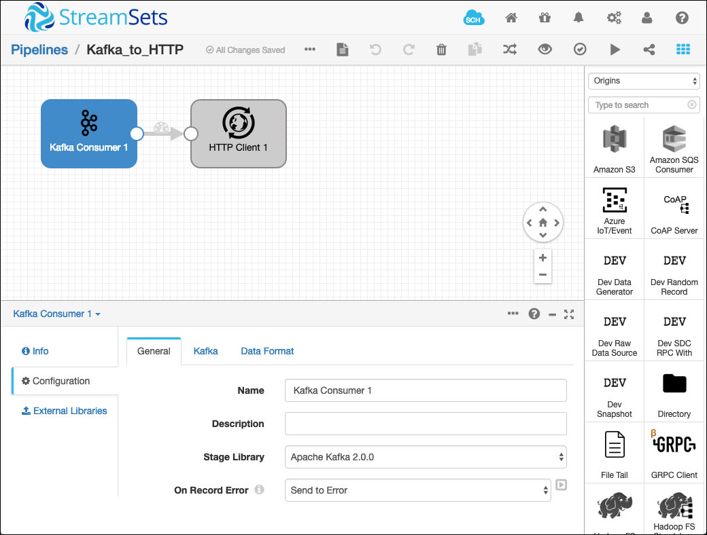
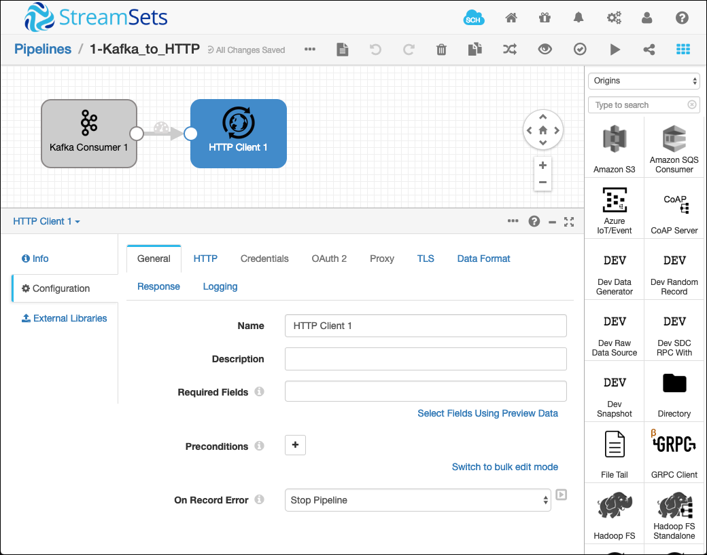
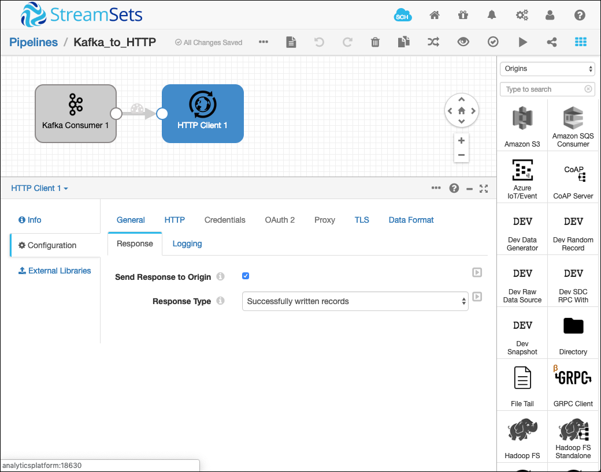
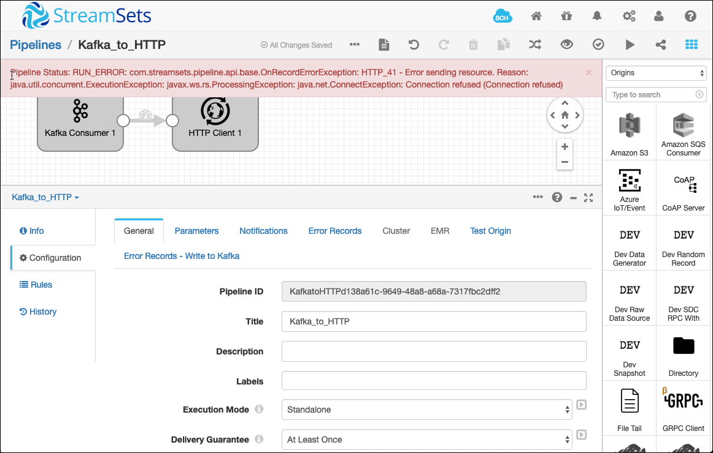

# Reliable Kafka Consumption using StreamSets Data Collector

The idea of this project is to demonstrate how a pipeline can be implemented, so that data from a Kafka topic are sent to an HTTP server in a reliable at-least-once fashion.  

## Preparation

First let's create the Kafka topics to be used for the tests.

```
docker exec -ti broker-1 kafka-topics --create \
--zookeeper zookeeper-1:2181 \
--topic sdc-test-1 --replication-factor 3 --partitions 2
```

Then let's start an HTTP server running on port 8000:

```
docker run -d --name httpserver -v /tmp/:/var/www:ro -p 8000:8080 trinitronx/python-simplehttpserver
```

```
docker logs -f httpserver
```

For producing test messages to Kafka, we will be using the `kafkacat` CLI utility. Install it using the following commmand:

```
sudo apt-get install kafkacat
```

Alternatively you can also use the `kafka-console-producer` from within one of the broker containers for producing messages:

```
echo '{ "f1":"v1" }' | docker exec broker-1 kafka-console-producer --broker-list broker-1:9092 --topic sdc-test
```

To follow the commits of the Kafka Consumer, you can follow the `__consumer_offsets` topic from within the `broker-1` container (this will be used later)

```
docker exec -ti broker-1 kafka-console-consumer \
--formatter "kafka.coordinator.group.GroupMetadataManager\$OffsetsMessageFormatter" \
--bootstrap-server broker-1:9092 --topic __consumer_offsets
```

## Version 1: Stopping the destination upon error

In this version we are implementing the destintion in such a way, that it stops the pipeline upon the first occurence of an error. We are using the singe topic [Kafka Consumer](https://streamsets.com/documentation/datacollector/3.7.2/help/datacollector/UserGuide/Origins/KConsumer.html) Origin together with the [HTTP Client](https://streamsets.com/documentation/datacollector/3.7.2/help/datacollector/UserGuide/Destinations/HTTPClient.html#concept_khl_sg5_lz) desitination, as shown below. 



### Implementation Details

This version is implemented in the 1-Kafka_to_HTTP pipeline, available as a StreamSets export in the `streamsets/1-Kafka_to_HTTP.json` file. 

On the **General** tab of the `HTTP Client` destination, make sure to select `Stop Pipeline` for the **On Record Error** drop down listbox. This will make sure that the pipeline is stopped immediately after an error occurs:



On the **Response** tab select the **Send Response to Origin** checkbox. 



### Testcase

**Test that everything works**

1. Start the Streamsets pipeline.

2. In a separte terminal window, stat a consumer on the `__consumer_offsets` topic.

	```
docker exec -ti broker-1 kafka-console-consumer \
--formatter "kafka.coordinator.group.GroupMetadataManager\$OffsetsMessageFormatter" \
--bootstrap-server broker-1:9092 --topic __consumer_offsets 
```

3. Using Kafkacat, let's produce a test messsage to the Kafka topic when the HTTP server is running:

	```
echo '{ "f1":"v1" }' | kafkacat -b localhost -t sdc-test-1
```

4. The log of httpserver should show that it got invoked and in StreamSets you should see 1 Input and 1 Output record. 

5. A commit message will be sent to the `__consumer_offsets` topic (and shown in the console consumer).

	```
[sdc-test-c1,sdc-test-1,0]::OffsetAndMetadata(offset=1, leaderEpoch=Optional.empty, metadata=, commitTimestamp=1550679310699, expireTimestamp=None)
```

**Test what happens when the HTTP server is not reachable**

1. For simulating an outage of the HTTP server, let's stop the container

	```
docker stop httpserver
```

2. Produce another test messsage to the Kafka topic:

	```
echo '{ "f1":"v1" }' | kafkacat -b localhost -t sdc-test-1
```

3. Immediately the pipeline will get stopped automatically, due to the HTTP server not being reachable.
	
	
	
4. You should see **no new commit message** in the `__consumer_offsets` topic!

5. The message is still waiting in the original topic to get re-consumed.

6. Let's produce another test messsage to the Kafka topic while the pipeline is stopped:

	```
echo '{ "f1":"v1" }' | kafkacat -b localhost -t sdc-test-1
```

	It will just be queued in the topic and processed when restarting the pipeline.

**Test that a restart of the Pipeline will recover failed and queued messages**

1. Restart the HTTP server

	```
docker start httpserver
```

2. Start the pipeline and you should see that 2 records are processed.

3. Also watch the `__consumer_offsets` topic consumer to see that two offset commits have been sent, one for each partition (due to not producing with a key).  

	```
[sdc-test-c1,sdc-test-1,1]::OffsetAndMetadata(offset=1, leaderEpoch=Optional.empty, metadata=, commitTimestamp=1550679901226, expireTimestamp=None)
[sdc-test-c1,sdc-test-1,0]::OffsetAndMetadata(offset=2, leaderEpoch=Optional.empty, metadata=, commitTimestamp=1550679901226, expireTimestamp=None)
	```

The test showed that we have not been losing a message due to the outage of the HTTP Server. 	

